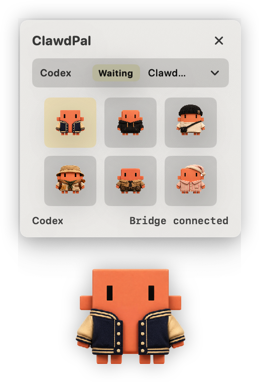
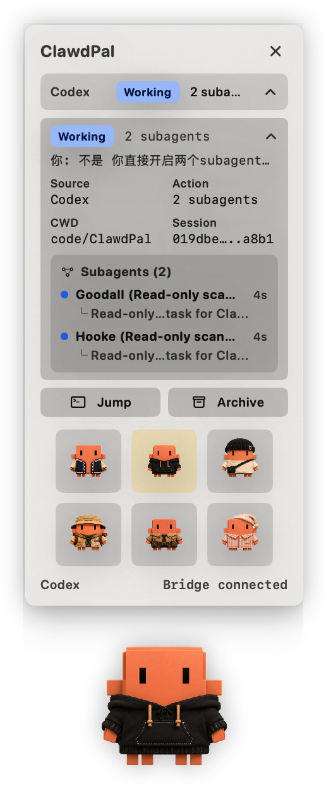
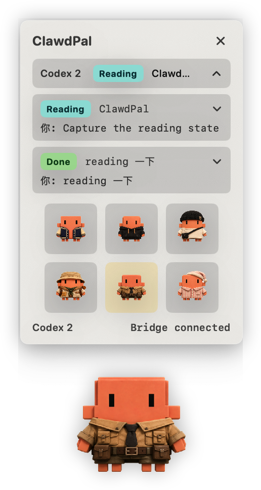
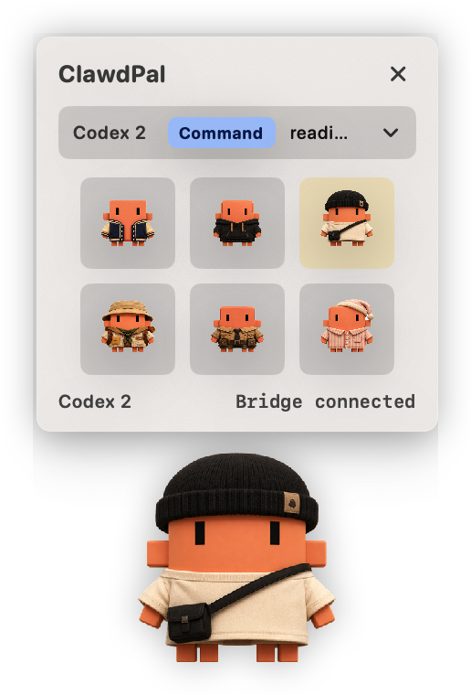
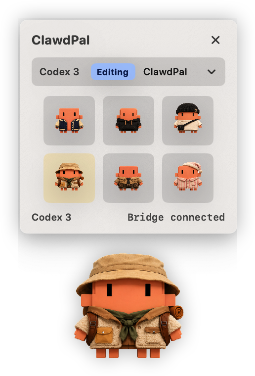
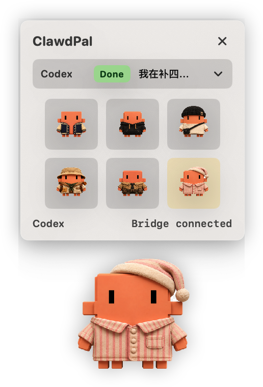

# ClawdPal

**A floating desktop buddy for macOS**

**爪爪搭子 · 你的 macOS 漂浮桌面宠物**

ClawdPal is a native macOS floating desktop buddy for AI coding sessions. It sits quietly on your desktop, watches local Claude Code and Codex activity, and turns agent work into a small expressive companion.

The app is local-first. Hook events are sent through a local Unix socket, transcript parsing happens on your machine, and ClawdPal does not upload telemetry or agent data.

## Features

- Floating transparent desktop pet for macOS.
- Six visual states mapped to agent activity:
  - idle
  - thinking
  - reading/searching
  - running commands
  - editing code
  - done
- Claude Code and Codex hook integration.
- Codex transcript monitoring for richer session context.
- Codex subagent grouping under the parent session.
- Session panel with source, task, action, working directory, session ID, Jump, and Archive.
- Hook Manager for installing, repairing, and removing supported hooks.
- Terminal Jump to return to the working directory for a session.
- Local Unix socket bridge with fail-open hooks, so agent work is not blocked if the app is closed.
- Native SwiftUI + AppKit window behavior, including floating panel, remembered position, right-click menu, and reset.

## Screenshots

<p>
  
  
</p>

<p>
  
  
  
  
</p>

## Supported Integrations

ClawdPal currently supports:

- Claude Code
- Codex

Both integrations are local hook-based integrations. The app receives summarized activity events such as prompts, tool calls, reads, commands, edits, permission requests, and completion.

## Requirements

- macOS 13 or later
- Xcode or Xcode Command Line Tools
- Swift 5.9 or later
- Claude Code and/or Codex if you want live agent activity

## Quick Start

Clone the repository:

```sh
git clone https://github.com/zhonghui5207/ClawdPal.git
cd ClawdPal
```

Build the project:

```sh
swift build
```

Create a local macOS app bundle:

```sh
scripts/build-app.sh
```

Open the app:

```sh
open .build/ClawdPal.app
```

This creates a local, unsigned development app bundle at `.build/ClawdPal.app`. It is intended for local use and testing.

For daily local use, install the app bundle to a stable location:

```sh
scripts/install-app.sh
```

By default this installs ClawdPal to `~/Applications/ClawdPal.app`, installs Claude Code and Codex hooks, and starts the installed app. Keeping the app in a stable path makes macOS permissions and hook paths less fragile than running directly from `.build`.

To install somewhere else:

```sh
CLAWDPAL_INSTALL_DIR=/Applications scripts/install-app.sh
```

## Packaging

Create a ZIP package:

```sh
scripts/package-zip.sh
```

The package is written to:

```text
dist/ClawdPal.zip
```

This ZIP is suitable for attaching to a GitHub Release while the project is still in early development.

Current release packages are ad-hoc signed but not notarized. On another Mac, the first launch may require explicit approval in macOS security settings.

## Install Hooks

You can install hooks from the app through the right-click menu:

```text
Right click ClawdPal -> Hook Manage
```

You can also install hooks from the command line.

Install hooks for both Claude Code and Codex:

```sh
swift run ClawdPalSetup install-all
```

Install only one integration:

```sh
swift run ClawdPalSetup install-claude
swift run ClawdPalSetup install-codex
```

Remove installed hooks:

```sh
swift run ClawdPalSetup uninstall-all
```

The setup tool backs up existing settings before writing. Uninstall only removes hooks whose command contains `ClawdPalHooks`, so unrelated hooks are left intact.

The hook command is fail-open: if ClawdPal is closed or unreachable, Claude Code and Codex keep running.

If you use `scripts/install-app.sh`, hooks are installed with the bundled hook binary at:

```text
~/Applications/ClawdPal.app/Contents/MacOS/ClawdPalHooks
```

This is the recommended local setup because the hook path stays stable across rebuilds.

## Permissions

ClawdPal only needs macOS Accessibility permission for terminal-window control.

Claude Code sessions use Terminal Jump to return to the matching terminal window. That requires Accessibility permission so ClawdPal can inspect and raise the correct window.

Codex sessions do not use terminal-window control. Their Jump action opens the Codex client directly.

You can check permission state in:

```text
Right click ClawdPal -> Hook Manage -> Terminal Access
```

States:

- `Ready`: Accessibility permission is enabled.
- `Needs access`: click the gear button to open macOS Accessibility settings.

ClawdPal checks permission state before using terminal-window control. It does not repeatedly trigger the system permission prompt.

## Development

Run the app directly:

```sh
swift run ClawdPalApp
```

Send a Claude-style test event:

```sh
echo '{"hook_event_name":"PreToolUse","tool_name":"Edit","session_id":"demo","tool_input":{"file_path":"Sources/App.swift"}}' | swift run ClawdPalHooks --source claude
```

Send a Codex-style test event:

```sh
echo '{"hook_event_name":"UserPromptSubmit","session_id":"demo","cwd":"/tmp/project","prompt":"continue implementation"}' | swift run ClawdPalHooks --source codex
```

Build the local app bundle:

```sh
scripts/build-app.sh
```

Install the app and hooks for local daily use:

```sh
scripts/install-app.sh
```

Build a ZIP package:

```sh
scripts/package-zip.sh
```

The generated bundle includes:

- `ClawdPalApp`
- `ClawdPalHooks`
- `ClawdPalSetup`
- bundled pet PNG assets

## Testing

Build verification:

```sh
swift build
```

Run tests:

```sh
swift test
```

If `swift test` cannot find the `Testing` module while `xcode-select` points at CommandLineTools, run tests through the full Xcode toolchain:

```sh
DEVELOPER_DIR=/Applications/Xcode.app/Contents/Developer swift test
```

Create and inspect the app bundle:

```sh
scripts/build-app.sh
open .build/ClawdPal.app
```

## Architecture

ClawdPal is split into a few small Swift targets:

- `ClawdPalApp`: native macOS floating pet app and session panel.
- `ClawdPalHooks`: hook entrypoint that reads JSON from stdin and forwards events locally.
- `ClawdPalSetup`: installs, repairs, and removes Claude Code / Codex hook settings.
- `ClawdPalCore`: shared models, hook decoders, settings helpers, transcript parser, and local bridge transport.

Runtime flow:

```text
Claude Code / Codex
        |
        v
ClawdPalHooks
        |
        v
Local Unix socket bridge
        |
        v
ClawdPalApp
        |
        v
Floating pet + session panel
```

Codex transcript monitoring is used as an additional local signal so the panel can show richer session context and group subagents under the correct parent session.

## Privacy

ClawdPal is designed to stay local:

- No telemetry.
- No cloud backend.
- No remote event upload.
- Hook events are forwarded through a local Unix socket.
- Codex transcript parsing reads local files from your machine.

You should still review hook configuration before using any tool that reads agent activity.

## Project Status

ClawdPal is an early local-first macOS project. The current build is usable for development and personal workflows, but it is not yet a signed or notarized public release.

Planned public-release work includes:

- signed release packaging
- demo media
- clearer onboarding for non-developers
- expanded documentation for hooks and privacy

See [ROADMAP.md](ROADMAP.md) for longer-term planning.

## Contributing

Issues and pull requests are welcome once the repository is public.

Good first areas to improve:

- macOS packaging and release flow
- UI polish and accessibility
- hook compatibility across Claude Code and Codex versions
- additional agent integrations
- documentation and onboarding

Please keep the project local-first and native macOS first.

## License

A license file should be added before the first public open-source release.
